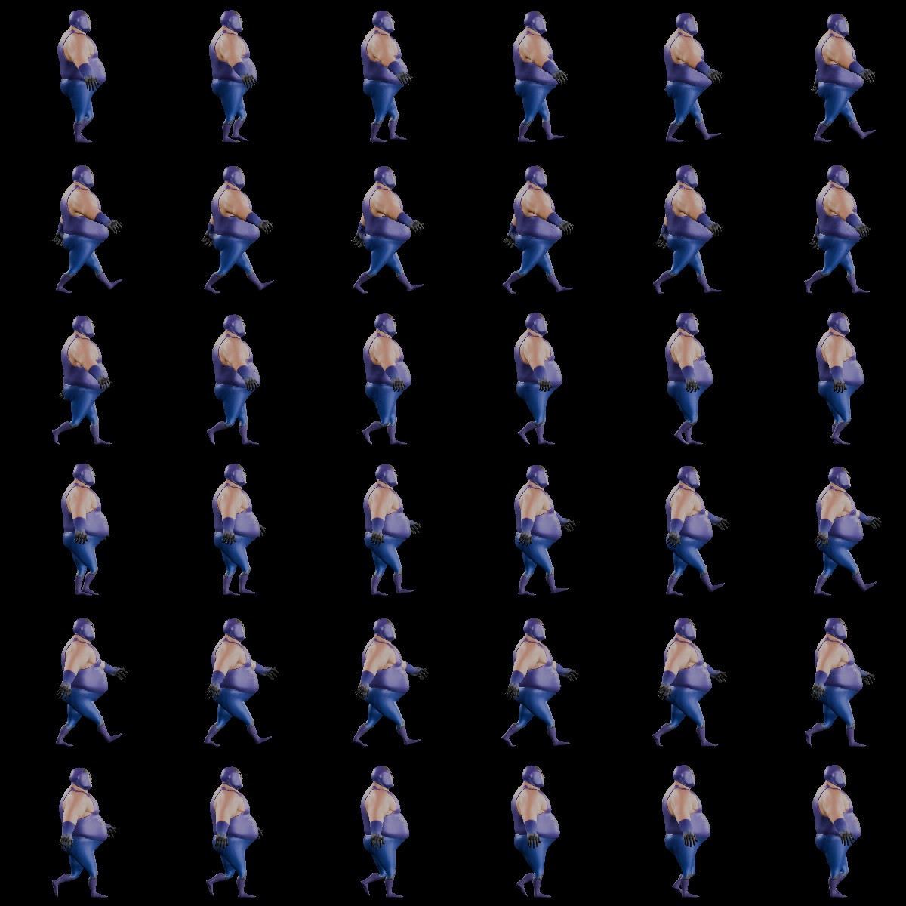

# 3D_to_SpriteSheet
A Blender 4.5 addon for generating sprite sheets from 3D model animations.  

---

## 📥 Installation

1. Open **Blender** and go to **Edit > Preferences... > Add-ons**.  
2. Click the ▼ arrow in the top-right corner of the window and select **Install from Disk...**.  
3. Locate `3D_to_SpriteSheet.py` using the file browser.  
4. Once installed, the addon will appear as **3D to Sprite Sheet** in the add-ons list.  

  

---

## 🎬 Example Usage

You can download example characters and animations from [Mixamo](https://www.mixamo.com/)  
*Character used: Ortiz | Animation: Walking*  

### 1. Render the Animation
- Complete your character’s animation.  
- Choose an accessible output directory.  
- Set the output **file format to PNG** (the only supported format).  
- Render the full animation.  

  

### 2. Generate the Sprite Sheet
1. Go to Blender’s **Compositor** tab.  
2. Open the **SpriteSheet** panel.  
3. Set the number of **rows** and **columns**.  
   - Example: `6 x 6` = 36 sprite images.  
4. Click **Open Image Sequence** and use the file browser to select your animation frames.  
   - **All images in the chosen directory are auto-selected.**  

  

  

### 3. Render the Sprite Sheet
- After importing, new compositor node groups will be created automatically.  
- Press **F12** (or Render) to generate the sprite sheet.  

  

  

